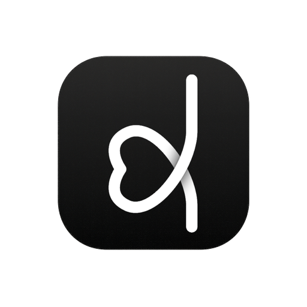
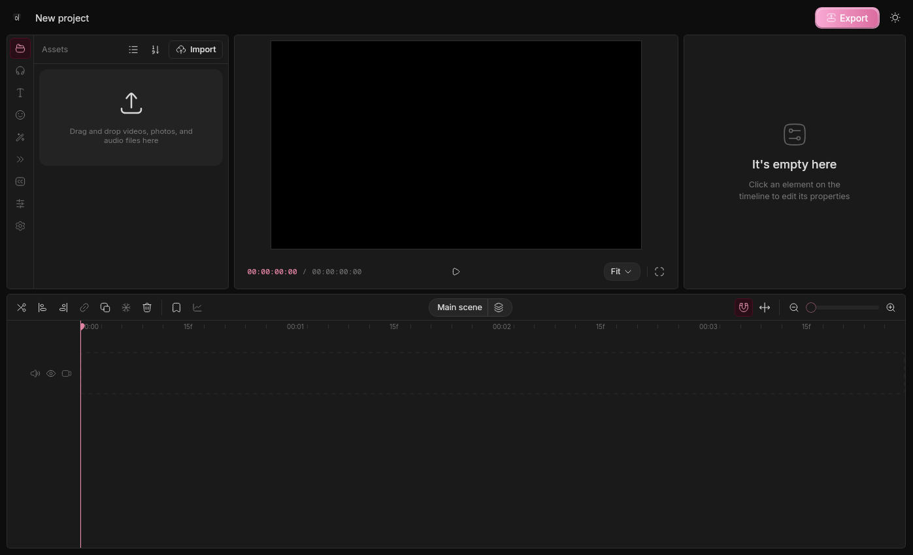

<div align="center">



# Editor

**A simple, powerful video editor for your desktop.**
Trim, layer, and export — fast.

<br />


[**Download**](https://github.com/koughen/Editor/releases) · [Build from source](#build-from-source) · [Tech](#stack)

</div>

<br />

<div align="center">
  
</div>

<br />

---

## Install

### One-liners

<table>
<tr>
  <th>macOS</th>
  <td>

```sh
brew install --cask koughen/editor/editor
```

  </td>
</tr>
<tr>
  <th>Windows</th>
  <td>

```powershell
scoop bucket add koughen https://github.com/koughen/scoop-editor
scoop install koughen/editor
```

  </td>
</tr>
<tr>
  <th>Linux (Arch / AUR)</th>
  <td>

Manual install via the `.AppImage` from [Releases](https://github.com/koughen/Editor/releases) — `chmod +x Editor*.AppImage && ./Editor*.AppImage`.

  </td>
</tr>
<tr>
  <th>Linux (Debian / Ubuntu)</th>
  <td>

```sh
curl -L -o editor.deb $(gh release view --repo koughen/Editor --json assets --jq '.assets[] | select(.name | endswith(".deb")) | .url' | head -1)
sudo apt install ./editor.deb
```

Or grab the `.deb` from [Releases](https://github.com/koughen/Editor/releases) and double-click.

  </td>
</tr>
<tr>
  <th>Linux (Fedora / openSUSE)</th>
  <td>

`.rpm` from [Releases](https://github.com/koughen/Editor/releases) — `sudo dnf install ./Editor-*.rpm`.

  </td>
</tr>
</table>

### Manual download

All installers — `.dmg`, `.msi`, `.AppImage`, `.deb`, `.rpm` — live on the [Releases page](https://github.com/koughen/Editor/releases).

#### "Editor cannot be opened because it's from an unidentified developer" (macOS)

The `.dmg` isn't code-signed (signing certs cost $99/yr). One-time fix after dragging `Editor.app` to `/Applications`:

```sh
xattr -d com.apple.quarantine /Applications/Editor.app
```

Or right-click the app the first time you open it → **Open** → confirm. The Homebrew install above bypasses this automatically.

#### "Windows protected your PC" (Windows)

Click **More info → Run anyway**. Same reason — no Authenticode signing cert.

<br />

## Build from source

You need **Rust**, **Bun**, and the WebKit2GTK dev libraries (Linux only).

```sh
# Linux deps (Arch)
sudo pacman -S webkit2gtk-4.1 libsoup3 base-devel

# macOS deps
xcode-select --install
```

Then:

```sh
git clone https://github.com/koughen/Editor.git
cd Editor
bun install

# Static frontend
bun --cwd apps/web run build

# Desktop bundle
cd apps/tauri/src-tauri
bunx @tauri-apps/cli@^2 build
```

Artifacts land in `apps/tauri/src-tauri/target/release/bundle/`:
- Linux: `deb/`, `rpm/`, `appimage/`
- macOS: `macos/Editor.app`, `dmg/Editor_*.dmg`
- Windows: `msi/`, `nsis/`

## Run in dev

```sh
# Web dev server (port 3001)
bun --cwd apps/web run dev -- -p 3001

# In another terminal — Tauri shell with hot reload
cd apps/tauri/src-tauri
WEBKIT_DISABLE_DMABUF_RENDERER=1 \
WEBKIT_DISABLE_COMPOSITING_MODE=1 \
bunx @tauri-apps/cli@^2 dev
```

The two env vars are a Wayland + WebKit2GTK workaround — drop them on macOS / Windows / X11.

<br />

## Stack

<table>
<tr>
  <td><b>Shell</b></td>
  <td>Tauri 2 (Rust)</td>
</tr>
<tr>
  <td><b>Frontend</b></td>
  <td>Next.js 16 + React 19, statically exported</td>
</tr>
<tr>
  <td><b>Editor core</b></td>
  <td>WebGPU/Canvas renderer, Mediabunny for codecs, custom Rust WASM time math</td>
</tr>
<tr>
  <td><b>Storage</b></td>
  <td>IndexedDB — projects live entirely on your machine</td>
</tr>
<tr>
  <td><b>Styling</b></td>
  <td>Tailwind v4, custom design tokens</td>
</tr>
</table>

<br />

## What's in this fork

This is a personal-use fork of [OpenCut](https://github.com/OpenCut-app/OpenCut) — repurposed as a local desktop app instead of a hosted SaaS. The web shell, marketing pages, auth, and server APIs are stripped out; what's left is the editor.

Differences from upstream:
- **Desktop-first.** Tauri shell, no web server in the loop.
- **Local everything.** No accounts, no telemetry, no remote calls.
- **Trimmed UI.** Direct boot into the projects screen.
- **Pink.** Why not.

<br />

## License

MIT — see [LICENSE](LICENSE).
Original work © OpenCut, 2025. Modifications © koughen, 2026.
